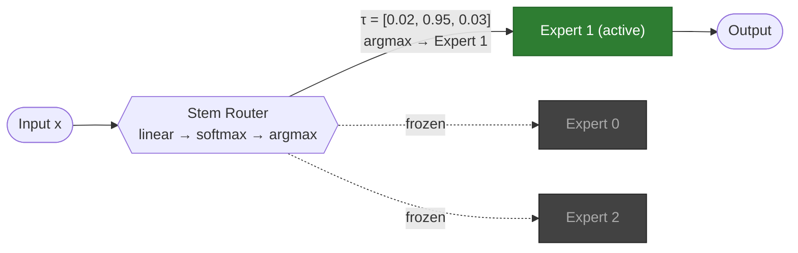
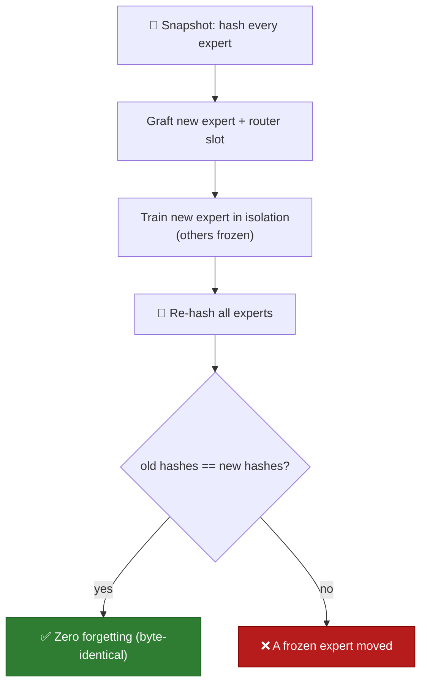

<div align="center">

# DAS

### Governance for fleets of AI models — add, remove, and audit capabilities without touching what's already certified

[](https://github.com/DDMX2022/das-framework/actions/workflows/ci.yml)
[](https://www.python.org/)
[](#license)


</div>

DAS is a **hard-routed Mixture-of-Experts** where every expert is **isolated, hot-swappable, and cryptographically auditable**. Route each request to exactly one expert; **graft** a new capability without disturbing the others; **prune** one to delete it cleanly; and get a **tamper-evident, signed audit trail** that proves non-interference.

It is the **governance layer** for a fleet of specialist models — it runs *under* your orchestration (LangGraph) and serving stack, not against them. The defensible value is not raw capability; it's **provable isolation, deletion, and auditability** for regulated and multi-tenant deployments.

> **Status — research preview.** The governance control plane, the deployable API, integrations, and a measured benchmark are built and tested. Scaling to large real-model backends and securing a production design partner are open ([roadmap](#roadmap)). This README keeps an [honest evaluation](#honest-evaluation) of what is proven vs. aspirational front and center — credibility is the point.

---

## Contents

- [Why DAS](#why-das)
- [Capabilities](#capabilities)
- [Quickstart](#quickstart)
- [Proof: the governance benchmark](#proof-the-governance-benchmark)
- [How it works](#how-it-works)
- [Deployment](#deployment)
- [Integrate under an orchestrator](#integrate-under-an-orchestrator)
- [Documentation](#documentation)
- [Honest evaluation](#honest-evaluation)
- [Roadmap](#roadmap)
- [Repository layout](#repository-layout)
- [License](#license)

---

## Why DAS

Production models are **monolithic** — one shared set of weights. That creates four problems DAS is built to fix:

| Problem with monolithic models | What DAS does instead |
|---|---|
| **Catastrophic forgetting** — teaching the model something new degrades what it knew. | Each capability is an **isolated expert**; training a new one leaves the others **byte-identical** (SHA-256 verified). |
| **Risky, slow updates** — any change re-opens validation of the *whole* model. | **Graft** a new expert without touching the rest, so you re-certify only the new piece. |
| **No clean deletion** — removing one capability or one tenant's data influence is unsolved in a shared network. | **Prune** an expert: its capability is gone, the rest provably untouched. |
| **No proof of isolation** — you can't show a regulator that tenant A wasn't affected by B. | A **signed audit trail of weight fingerprints** *is* the compliance evidence. |

**DAS is for teams who must answer:** *"Prove adding this feature didn't change the certified model." · "Delete this tenant's model and prove it's gone." · "Show tenant A's data never influenced tenant B's model."* Monolithic models — and even standard fine-tuning / MoE — cannot answer these cleanly.

**DAS is not** trying to be a smarter or cheaper model than a frontier LLM. It is a **governance layer for a fleet of models**: it sits under LangGraph and uses LoRA-style adapters as the expert format.

---

## Capabilities

- **Provable isolation** — adding or retraining one expert leaves every other byte-identical (SHA-256 weight hashing).
- **Zero catastrophic forgetting** — structural, not a soft penalty: BWT = 0.000, proven cryptographically.
- **Right-to-be-forgotten** — delete one expert or an entire tenant; survivors proven byte-identical, deleted capability structurally gone.
- **Tamper-evident audit log** — every privileged action (and every *denied* attempt) is HMAC-signed and hash-chained; any edit/reorder/insert is detected.
- **RBAC + multi-tenancy** — `admin / operator / auditor / viewer` roles, operators scoped per tenant; denials are logged.
- **Per-query provenance** — every routed answer carries which tenant/expert served it, and the router's confidence.
- **Persistence with state↔audit binding** — save/restore is byte-identical, and a swapped (unsigned) weights file is caught against the signed log.
- **Deploy-ready** — a NumPy + Flask REST control plane, a torch-free Docker image, and a Kubernetes manifest.
- **Integrates under orchestrators** — drop-in LangGraph node.

---

## Quickstart

Requires Python 3.9+. The governance control plane is **NumPy + Flask only** (no PyTorch).

```bash
pip install -e ".[web]"     # governance control plane + REST API
# or: pip install -e .             (NumPy core only)
#     pip install -e ".[hf]"       (real frozen text encoder: torch + sentence-transformers)
#     pip install -e ".[all]"      (everything: torch, flask, sentence-transformers, scikit-learn, pandas)
```

### Run the governance API

```bash
DAS_AUDIT_SECRET=prod-secret DAS_STATE=./state python apps/governance_api.py   # http://localhost:5070
```

On boot it loads a persisted fleet from `DAS_STATE`, or bootstraps a demo two-tenant fleet. The audit secret is supplied at runtime and **never written to disk**.

```bash
curl localhost:5070/health
#   { "experts": 4, "tenants": ["acme","globex"], "audit_chain_ok": true, "state_matches_audit": true, ... }

curl -X POST localhost:5070/predict -H 'Content-Type: application/json' \
     -d '{"embedding": [ ...d floats... ]}'
#   { "tenant": "globex", "name": "globex-vision", "eid": 2, "confidence": 0.99, "prediction": [...] }

curl -X POST localhost:5070/delete_tenant -H 'X-DAS-Actor: root' \
     -H 'Content-Type: application/json' -d '{"tenant":"acme"}'      # right-to-be-forgotten

curl localhost:5070/audit/verify                                     # re-walk the signed chain
```

| Endpoint | Purpose |
|---|---|
| `GET /health` | fleet status + audit-chain health |
| `GET /experts` | registry (tenant-scoped to the caller) |
| `POST /predict` | routing with provenance |
| `POST /prune` · `POST /delete_tenant` | right-to-be-forgotten |
| `GET /audit` · `GET /audit/verify` | the tamper-evident log |
| `POST /save` | persist current state |

> Identity is taken from the `X-DAS-Actor` header and is **asserted, not authenticated** — run the API behind an authn proxy (mTLS/OIDC). See the [security review](docs/SECURITY_REVIEW.md).

### Try the interactive console

```bash
python apps/console.py        # http://localhost:5070
```

Route a query and watch it hit the right expert; graft a new expert (existing ones stay byte-identical); prune one; and watch the SHA-256 audit trail update live. With the `[hf]` extra installed, the console runs on a **real frozen pretrained sentence encoder (MiniLM) over real text** — each expert is a LoRA adapter on those embeddings; with only `torch` it uses synthetic vectors; with neither, the NumPy core.

### See the guarantees, with numbers

```bash
python benchmarks/governance_benchmark.py  # Monolith vs Isolated experts vs DAS control plane
python examples/control_plane_demo.py      # RBAC, tenant-delete isolation, tamper detection, persistence
python examples/demo.py                    # core lifecycle + the byte-identical forgetting proof (NumPy only)
python examples/hf_governance_demo.py      # the same guarantees on a REAL encoder + REAL text ([hf] extra)
pytest -q                          # full test suite
```

---

## Proof: the governance benchmark

A reproducible, deterministic head-to-head on the axes that matter — not raw accuracy, but **governance**. Three ways to run a fleet across two tenants: a **Monolith** (one shared model fine-tuned per task), **Isolated experts** (the LoRA-per-task equivalent), and the **DAS control plane**. Run it yourself: [`benchmarks/governance_benchmark.py`](benchmarks/governance_benchmark.py).

| Governance axis | Monolith | Isolated experts | **DAS control plane** |
|---|:---:|:---:|:---:|
| Mean task accuracy | 0.55 | 0.95 | 0.94 |
| Forgetting (BWT, 0 = none) | **−0.467** | 0.000 | **0.000** |
| Add a capability: others byte-identical | 0% | 100% | **100%** |
| Delete: survivors byte-identical | 0% | 100% | **100%** |
| Capability actually removable | ✗ | ✓ | **✓** |
| Tamper-evident audit log | ✗ | ✗ | **✓** |
| RBAC enforced | ✗ | ✗ | **✓** |
| Per-query provenance | ✗ | ✗ | **✓** |

**How to read this honestly:** the monolith fails every isolation requirement. Isolated adapters fix the top half — and **DAS ties them there**, because that is simply what isolation buys (DAS ≈ LoRA + a router). DAS's distinct, measured contribution is the **bottom half — audit, RBAC, provenance** — the governance plane you would otherwise build yourself.

---

## How it works

1. **Stem Router** ([`das/routing.py`](das/routing.py)) — a linear layer + softmax; `argmax` selects exactly one expert (hard top-1 routing). Trained to predict each input's domain.
2. **Expert leaf** ([`das/functional.py`](das/functional.py)) — a standalone MLP with a `frozen` flag, so a frozen expert cannot move even when gradients flow. `weight_hash()` is its SHA-256 fingerprint.
3. **Forest** ([`das/model.py`](das/model.py)) — routes inputs to experts; `graft()` adds an expert plus a router slot.
4. **Control plane** ([`das/governance.py`](das/governance.py)) — wraps the forest with RBAC, multi-tenancy, the signed audit log, and persistence. Backend-agnostic via a `train_fn` callback, so the guarantees hold over the NumPy core or a torch LoRA backend.

### Inference — one input, one expert

The router commits 100% of the signal to a single expert; all others stay frozen and untouched.



### The forgetting proof

Each expert is trained in isolation. Before grafting a new one, every existing expert is fingerprinted with SHA-256; after training, the fingerprints are re-checked. They are always byte-identical — that is the proof.



The mature design uses a **shared frozen backbone** (features extracted once), the **router on those features**, tiny **isolated heads** per capability, and a continuous **grow → graft → prune → regrow** lifecycle — every frozen head provably byte-identical across the whole cycle.

---

## Deployment

The control plane is packaged as a torch-free image (small, non-root, state on a volume, audit secret from the environment):

```bash
docker build -t das-governance .
docker run -p 5070:5070 -e DAS_AUDIT_SECRET=prod-secret -v das_state:/data das-governance
```

Kubernetes (`Deployment` + `Service` + `PVC` + audit `Secret`):

```bash
kubectl apply -f deploy/k8s.yaml
```

A single replica owns the audit chain (single writer). State persists on the PVC, so the forest and the signed log survive restarts.

---

## Integrate under an orchestrator

DAS slots **beneath** the orchestrator you already use. [`DASExpertNode`](das/integrations/langgraph_node.py) is a plain `state -> state` callable (LangGraph's node contract, no hard dependency): it routes a query to the right governed expert and writes provenance — tenant, expert, confidence, acting principal — back into graph state, so the orchestrated run is attributable. RBAC denials surface as state rather than crashing the graph.

```python
from das.integrations import DASExpertNode, build_graph

node = DASExpertNode(control_plane)          # use directly, or:
graph = build_graph(control_plane)           # compile a minimal LangGraph StateGraph
graph.invoke({"embedding": vec, "actor": "svc"})
#   -> {..., "das_tenant": "globex", "das_expert": "globex-vision", "das_confidence": 0.99}
```

See [`examples/langgraph_demo.py`](examples/langgraph_demo.py) for an end-to-end two-tenant example.

---

## Documentation

| Document | What's in it |
|---|---|
| [CASE_STUDY.md](docs/CASE_STUDY.md) | A worked multi-tenant regulated-AI scenario (illustrative), each requirement mapped to a measured capability. |
| [SECURITY_REVIEW.md](docs/SECURITY_REVIEW.md) | Threat model, what's protected, and a ranked list of real gaps (authors' self-review). |
| [STATUS.md](docs/STATUS.md) | Single-page summary of everything built and every measured number. |
| [PRODUCT_PLAN.md](docs/PRODUCT_PLAN.md) | The phased plan from research prototype to product. |

---

## Honest evaluation

Credibility is the product, so the limitations are documented as plainly as the strengths.

**What is genuinely proven:**
- Isolated, hot-swappable experts with **zero catastrophic forgetting** (byte-identical, BWT 0), provable deletion, and multi-tenant isolation.
- A tamper-evident signed audit log, RBAC, persistence with state↔audit binding, and per-query provenance — all tested.

**What DAS is — and is not:**
- DAS is, at its core, a competent **hard-routed Mixture-of-Experts ≈ per-task LoRA + a router** ([`benchmarks/lora_bench.py`](benchmarks/lora_bench.py)). On isolation, forgetting, and deletion it **ties** isolated LoRA adapters — it does not beat them. Its edge is the **task-free router plus the governance plane**.
- The branding from the original concept (Fibonacci layer widths, "vector torque", "coiled strings") is **cosmetic** over a standard softmax-routed MoE — measured, not asserted: Fibonacci vs power-of-two vs linear widths score within 0.006 ([`benchmarks/leaf_shapes_bench.py`](benchmarks/leaf_shapes_bench.py)).

**Known limits:**
- **Routing is the bottleneck on hard data.** A linear router collapses to 0.42 on raw CIFAR; a shared conv backbone only lifts it to 0.66 (vs ~0.98 on MNIST). The experts are fine; routing caps end-to-end quality.
- **Scale is unproven** at large-real-model sizes; the sparse mechanic scales (stored grows, active/latency flat) but real-LLM quality is not demonstrated.
- **Self-organising routing and auditable isolation are in tension:** co-training the router to discover domains unsupervised destroys the byte-identical guarantee. You get one or the other ([`benchmarks/unsupervised_routing.py`](benchmarks/unsupervised_routing.py)).
- Claims of "beating frontier models" or large cost cuts are **unsupported** by any measurement here.

The defensible home is **governance — auditable, isolated, deletable model fleets — not raw capability.**

---

## Roadmap

| Phase | Goal | Status |
|---|---|---|
| **0 · Foundation** | Credible engineering | ✅ Versioned package, green CI, test suite |
| **1 · Real backend** | Stop being toy-scale | 🟡 Real frozen pretrained encoder (MiniLM) + real text in the console & demo; LoRA-on-the-transformer + large-model scale remain |
| **2 · Governance control plane** | The product | ✅ Signed audit, RBAC, multi-tenancy, registry, persistence |
| **3 · Integrations** | Fit existing stacks | 🟡 LangGraph node + Docker/k8s deploy done; HF Hub interop remains |
| **4 · Prove & launch** | Evidence + GTM | 🟡 Benchmark + case study + self security review done; real design partner, independent audit, open-core 1.0 remain |

**North star:** *governed AI capabilities you can add, remove, and audit without touching what's already certified.* Full detail in [PRODUCT_PLAN.md](docs/PRODUCT_PLAN.md).

---

## Repository layout

```
das/                         NumPy core + governance (the product)
├── functional.py            Expert leaf (MLP + frozen flag + weight_hash)
├── routing.py               Stem Router (linear → softmax → argmax)
├── model.py                 DASForest — router + leaves, graft/prune, proofs
├── lifecycle.py             Grow → graft → prune → regrow loop
├── audit.py                 Tamper-evident, HMAC-signed, hash-chained log
├── governance.py            ControlPlane — RBAC, multi-tenancy, persistence
├── integrations/            Adapters that slot DAS under existing stacks
│   └── langgraph_node.py    DASExpertNode — governed expert as a LangGraph node
└── hub.py                   Leaf marketplace (publish / pull / graft, hash-verified)
das_torch.py                 PyTorch backend (autograd, checkpointing, ConvLeaf, LoRA)
das_text.py                  Real frozen pretrained encoder (MiniLM) + real demo text

apps/                        Runnable entry points
├── governance_api.py        REST control plane (NumPy + Flask) — the deployable unit
├── console.py               Interactive product UI
├── serve.py                 Torch-backed inference server
├── app.py                   Research visualizer dashboard
└── templates/               HTML for the Flask apps

examples/                    Demos (hf_governance_demo, governance_demo, langgraph_demo, lifecycle, …)
benchmarks/                  Benchmarks + research scripts
├── governance_benchmark.py  Monolith vs Isolated vs DAS-CP (with numbers)
├── lora_bench.py            DAS ≈ per-task LoRA + a router
├── leaf_shapes_bench.py     Fibonacci vs power-of-two vs linear widths
└── …                        CIFAR/MNIST stress, scaling, routing studies

deploy/                      Dockerfile (root) + k8s.yaml — containerize & deploy
docs/                        STATUS · PRODUCT_PLAN · CASE_STUDY · SECURITY_REVIEW
tests/                       Test suite (NumPy core runs in CI)
```

`examples/` and `benchmarks/` cover an extensive set of demos and research studies (continual-learning baselines, CIFAR/MNIST stress tests, paging, scaling, the web visualizer). Every one is logged with measured results in [STATUS.md](docs/STATUS.md). Run scripts from the repo root after `pip install -e .` so `das` and `das_torch` resolve.

---

## License

MIT.
