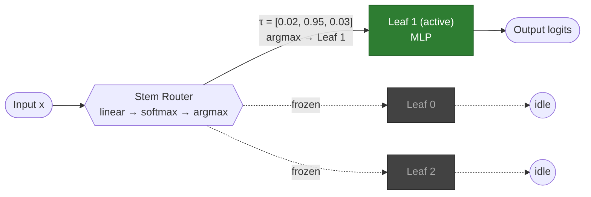
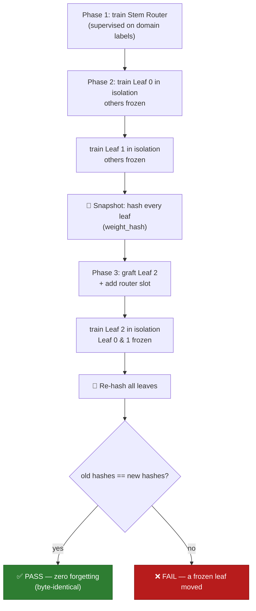
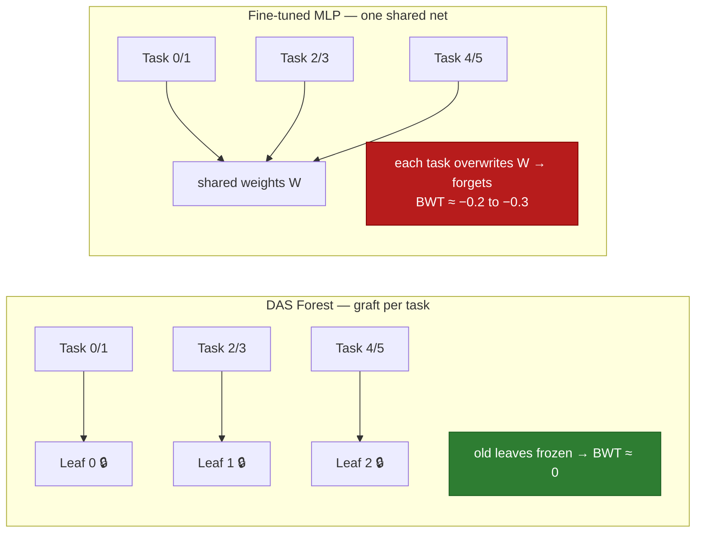
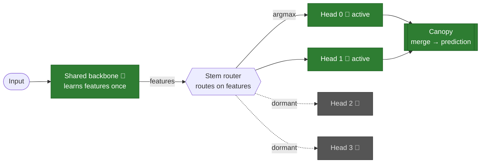
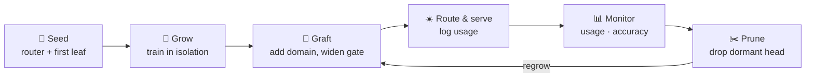

# DAS Framework

A runnable research prototype of a **hard-routed Mixture-of-Experts** — branded "DAS" (a forest of *leaves*, a *stem router*, a *canopy*). Stripped of the branding, it is a clean, honest implementation of an idea worth testing: route each input to exactly **one** expert network, train each expert in **isolation**, and **graft** new experts without touching the old ones.

The one property this design genuinely delivers — and that this repo cryptographically proves — is **zero catastrophic forgetting**: training a new expert leaves every existing expert *byte-identical* (verified by SHA-256).

> This is a learning/benchmarking scaffold, not a language model. See [What is real vs. hype](#what-is-real-vs-hype).

---

## What's in here

```
das-framework/
├── das/                    NumPy core (manual backprop, no autograd)
│   ├── functional.py       FibonacciLeaf  — an expert MLP + frozen flag + weight_hash()
│   ├── routing.py          StemRouter     — MoE gate (linear → softmax → argmax)
│   ├── model.py            DASForest      — assembles router + leaves, graft(), proofs
│   ├── packnet.py          PackNetMLP     — pruning + per-task weight masks (CL baseline)
│   └── lifecycle.py        ForestLifecycle — usage monitor, prune, regrow loop
├── demo.py                 Full lifecycle on synthetic data + forgetting proof (NumPy)
├── benchmark.py            DAS vs matched-size MLP on sklearn digits (NumPy)
├── lifecycle_demo.py       Forest lifecycle: grow → graft → prune → regrow (NumPy)
├── das_torch.py            PyTorch backend: trainer, leaf_hash, checkpoint/restore, ConvLeaf
├── demo_torch.py           PyTorch lifecycle on MNIST + forgetting proof (autograd path)
├── checkpoint_demo.py      Per-leaf + whole-forest save/load byte-exact restore proofs
├── conv_demo.py            ConvLeaf (CNN expert) trained, frozen, checkpointed
├── backbone_demo.py        Phase 9: shared frozen backbone + isolated heads (MNIST)
├── serve.py                REST inference API (loads a saved forest, POST /predict)
├── mnist_stress.py         PyTorch: 10 leaves on real MNIST + 10-way forgetting proof
├── app.py                  Flask server — 6 live, browser-streamed experiments
├── templates/              UI for the web app (SSE + Chart.js)
│   ├── index.html          Forest demo + digits benchmark
│   ├── stress.html         MNIST stress test
│   ├── real_bench.html     Real-world multi-dataset benchmark
│   ├── continual_bench.html Split-MNIST continual learning
│   └── permuted_bench.html  Permuted-MNIST continual learning
├── checkpoints/            saved leaves/forests (gitignored; written by the demos)
└── data/MNIST/raw/         MNIST IDX files (downloaded by mnist_stress.py)
```

---

## Quick start

The NumPy demo needs only `numpy`. The web app adds `flask`, the digits benchmark adds `scikit-learn`, and the PyTorch scripts add `torch`/`torchvision`.

> **Mac note:** Homebrew Python 3.14 currently ships a broken `libexpat` and `pip` won't run. Use conda or Python 3.13.

```bash
# recommended: conda
conda create -n das python=3.11 numpy
conda activate das

# core demo (NumPy only)
python demo.py
```

### The five web experiments

```bash
pip install flask scikit-learn
python app.py
# → http://localhost:5050
```

| Route | Page | What it runs |
|-------|------|--------------|
| `/` | **Forest demo** + **Digits benchmark** | Animated tree growth on synthetic data; DAS vs matched MLP on sklearn digits |
| `/stress` | **MNIST stress test** | 10 leaves × 784-dim, router + 10 isolated leaves vs a 10-class baseline; 45-pairwise forgetting proof |
| `/real` | **Real-world benchmark** | Adult Income, Wine Quality, Credit Default (OpenML), with download progress + heartbeat |
| `/continual` | **Split-MNIST continual learning** | DAS vs EWC vs PackNet vs Fine-tuned vs Multi-task, live accuracy matrices + contamination test |
| `/permuted` | **Permuted-MNIST continual learning** | same five models on the domain-incremental regime |
| `/benchmark` (stream) | digits SSE stream | backing stream for the `/` benchmark tab |

The web app reads MNIST directly from `data/MNIST/raw/*.gz` (stdlib `gzip` + `numpy`, no torchvision). If those files are missing, run `python mnist_stress.py` once to download them.

### PyTorch backend (Apple Silicon)

`das_torch.py` is the real autograd backend (not just a smoke test): isolated training, SHA-256 leaf hashing, per-leaf and whole-forest checkpoint/restore, and a `ConvLeaf` CNN expert. Four runnable demos:

```bash
pip install torch torchvision
python demo_torch.py        # full lifecycle on MNIST + forgetting proof (~6s, CPU)
python checkpoint_demo.py   # byte-exact save/load + graft-from-disk proofs
python conv_demo.py         # a CNN leaf trained, frozen, checkpointed, restored
python mnist_stress.py      # 10-leaf MNIST, ~20s on M-series (auto-selects mps)
```

The proof demos force CPU for bit-reproducible hashes; heavy training auto-selects MPS.

### REST inference API

`serve.py` loads a forest saved by `demo_torch.py` and serves predictions:

```bash
python serve.py                                  # port 5060
curl localhost:5060/health                        # {"leaves":3,"status":"ok"}
curl -X POST localhost:5060/predict \
     -H 'Content-Type: application/json' \
     -d '{"pixels": [ ...784 floats... ]}'         # -> {"leaf":i,"prediction":c,"confidence":p}
```

Each input is routed to exactly one leaf; the response says which leaf fired. Out-of-domain inputs are misrouted (honestly — no leaf was trained on them).

---

## How the architecture works

1. **Stem Router** (`routing.py`) — a single linear layer + softmax. The softmax output is the "vector torque" τ; `argmax(τ)` picks exactly one leaf (hard top-1 routing). Trained supervised to predict each input's domain.
2. **FibonacciLeaf** (`functional.py`) — a standalone MLP with manual forward/backward. A `frozen` flag gates the weight update, so a frozen leaf cannot move even when gradients flow. `weight_hash()` returns a SHA-256 fingerprint used to prove that.
3. **DASForest** (`model.py`) — routes each input to its leaf, collects outputs. `graft()` adds a new leaf **and** a new router slot (the router must learn the new route — see [hype notes](#what-is-real-vs-hype)).

### Inference: one input, one leaf

At prediction time the router commits 100% of the signal to a single leaf. All other leaves stay frozen and are never touched — that hard top-1 path is what bounds compute and gradient flow to one expert.



### Training lifecycle + the forgetting proof

Each leaf is trained in isolation (router frozen, all other leaves frozen). Before grafting a new leaf, every existing leaf is fingerprinted with SHA-256; after training the new leaf, the fingerprints are re-checked. They are always byte-identical — that is the proof.



### Continual learning: why DAS doesn't forget

The `/continual` page runs this comparison on Split-MNIST. A fine-tuned MLP overwrites shared weights each task (old-task accuracy decays → negative BWT); DAS adds an isolated leaf per task (old leaves untouched → BWT ≈ 0).



### The forest concept

The evolved design (Phase 9): one **shared frozen backbone** extracts features once; the **router routes on those features**; each leaf is a tiny **isolated head**; a **canopy** merges the active head(s) into a prediction. Dormant heads cost nothing; new heads graft on; stale heads are pruned.



It behaves like a living forest — a continuous **grow → graft → prune → regrow** loop, with every frozen head provably byte-identical across the whole cycle (`lifecycle_demo.py`):



> Roadmap (Phase 13): many such trees linked underneath by a dense LLM — the "mycelial soil" — that decomposes a prompt across trees and synthesises their outputs. Not built yet.

---

## Benchmarks & metrics

- **Digits / MNIST:** DAS specialist leaves are compared against a single MLP of matched parameter count. Each leaf only ever sees its own domain's gradient, so it can't be pulled off-task by unrelated data.
- **Continual-learning baseline suite** — two pages, the honest competitor set: **DAS** vs **EWC** (Elastic Weight Consolidation) vs **PackNet** vs **Fine-tuned MLP** vs **Multi-task MLP** (upper bound).
  - **Split-MNIST** (`/continual`) — class-incremental, single-head: 5 binary tasks (0v1 … 8v9). The known-hard regime for soft methods.
  - **Permuted-MNIST** (`/permuted`) — domain-incremental: same 10-class task, a fixed pixel permutation per task. The regime where EWC is *expected* to work — included precisely so the suite isn't cherry-picked to always favor DAS.
- **Metrics reported:** Backward Transfer (BWT), plasticity (diagonal accuracy), stability (final ÷ first-learned), stored vs. active parameters, inference FLOPs, and wall-clock training time per phase.

Measured BWT (higher = less forgetting):

| Model | Split-MNIST | Permuted-MNIST | How it avoids forgetting |
|---|---|---|---|
| **DAS Forest** | **0.000** | **0.000** | structural — a frozen leaf per task |
| **PackNet** | **0.000** | **0.000** | structural — frozen weight masks in one fixed net |
| EWC MLP | −0.33 | **−0.03** | soft penalty; works in the easy regime, fails in the hard one |
| Fine-tuned MLP | −0.40 | −0.12 | nothing — catastrophic forgetting |

Two honest takeaways the suite is designed to surface: (1) **EWC's BWT improves ~10× from Split→Permuted** — exactly the documented regime sensitivity (van de Ven & Tolias, 2019); a benchmark that only ever favored DAS would be untrustworthy. (2) **PackNet matches DAS on forgetting but not on plasticity**: it shares one fixed-capacity network, so as weights get claimed, later tasks have fewer free weights and new-task accuracy erodes (measured: free weights 41.8k→31.4k→20.9k→10.5k→0 across the 5 tasks). DAS instead grows a new leaf per task — unbounded capacity at the cost of more stored parameters (but the same ~1-leaf inference cost).

- **Cross-domain contamination test** (`/continual`): every trained leaf is run on every task's test set. The diagonal (own domain) stays ~99%; off-diagonal (wrong domain) collapses to ~52% (binary chance). This proves leaves are genuine specialists **and** that the router is doing essential work — without it picking the diagonal, the forest would be near chance.

---

## What is real vs. hype

| Branded term | What it actually is |
|---|---|
| Vector torque (τ) | The router's softmax output — routing probabilities. |
| Stem Router | A standard MoE gate (linear + softmax + argmax). |
| Fibonacci leaf | An MLP whose layer widths happen to be Fibonacci numbers. |
| Coiled strings | Embedding vectors / hidden states. |
| Absolute domain isolation | Each expert is a separate net; freezing it freezes it. **Real.** |
| Modular grafting | Add a new expert and train only it. **Real.** |

**Claims to ignore:**
- **Fibonacci dimensions are not magic.** `144→89→55` works no better than `128→96→64`; widths are ordinary hyperparameters.
- **"You never touch the router when adding a domain" is false.** Experts stay isolated, but the router must learn the new route — see `graft()`.
- **Running 100B-param models on a laptop** does not follow from routing alone.
- This classifies small vectors/images. It is a scaffold, not an LLM.

---

## Honest positioning

DAS is not "better AI." It's **modular, auditable AI** for one specific pain: adding new capabilities without disturbing what's already deployed — zero-downtime domain expansion, compliance isolation (the hash proof is an audit trail), and incremental cost. The defensible angle vs. Avalanche / Flower / transformer-MoE is the **auditability + proof-of-isolation** story.

## Next steps

- ✅ **Done (Phase 5):** EWC baseline + cross-domain contamination test on `/continual`.
- ✅ **Done (Phase 6):** PackNet baseline and the Permuted-MNIST regime (`/permuted`).
- ✅ **Done (Phase 7):** PyTorch backend — autograd trainer, per-leaf & whole-forest checkpoint/restore (byte-exact), `ConvLeaf` CNN expert, and a REST inference API (`serve.py`).
- ✅ **Done (Lifecycle):** `ForestLifecycle` — usage monitoring, dormancy-based pruning (with router-gate shrink), and regrow. The full grow → graft → prune → regrow loop, with the forgetting proof holding across prune *and* regrow (`lifecycle_demo.py`).
- ✅ **Done (Phase 9):** `BackboneForest` — a shared frozen backbone feeds a router that routes on *learned features* (not raw pixels), with tiny isolated heads (130 params each, ~1672× smaller than the backbone) sharing those features. Forgetting proof holds when grafting a new head (`backbone_demo.py`). Tradeoff: the backbone is a shared trainable component.
1. Split-CIFAR-10/100 on `ConvLeaf` forests — does routing survive real images?
2. Progressive Neural Networks as another structural baseline; an attention-based router.
3. Scale up: larger leaves on MPS/GPU, a tokenizer+embedding front-end for a text domain.
